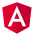

<h3 align="center">
  🚀 Fullstack Developer & UI Craftsman
</h3>

  

<h3 align="center">
  
</h3>

<h3 align="center">👤 About Me</h3>
<table>
<tr>
<td width="60%" valign="top">

I'm a **Fullstack Developer** based in Germany, passionate about building modern, scalable web applications with clean architecture and great user experience.

- 🏢 Currently studying as a Fullstack Developer  
- 🎯 Focus: performance optimization, UI/UX, and developer tooling  
- 🌍 Languages: Romanian, Russian, German, English
- 🔭 Currently working on REST APIs built with Django and Django REST Framework
- 🧩 Comfortable across the stack — from database models to the interfaces that consume them
- 📫 Open to backend/fullstack opportunities — feel free to reach out

</td>
<td width="40%">

</td>
</tr>
</table>

<h3 align="center">🛠️ Tech Stack</h3>

<h3 align="center">Frontend</h3>

<h3 align="center">Backend</h3>

<h3 align="center">Database</h3>

<h3 align="center">Tools & Platforms</h3>

<h3 align="center">📊 GitHub Activity</h3>

  <picture>
    <source media="(prefers-color-scheme: dark)" srcset="https://raw.githubusercontent.com/vadim-cebanu/vadim-cebanu/output/github-snake-dark.svg" />
    <source media="(prefers-color-scheme: light)" srcset="https://raw.githubusercontent.com/vadim-cebanu/vadim-cebanu/output/github-snake.svg" />
    
  </picture>

<h3 align="center">📫 Get in Touch</h3>

💼 <a href="https://linkedin.com/in/cebanu-vadim">LinkedIn</a> &nbsp;•&nbsp;
🌐 <a href="https://vadimcebanu.dev">Portfolio</a> &nbsp;•&nbsp;
📧 <a href="mailto:info@vadimcebanu.dev">info@vadimcebanu.dev</a>

  <i>“The best error message is the one that never shows up.”</i> — Thomas Fuchs

